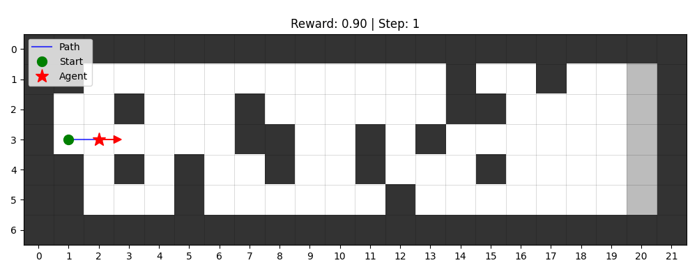

## 📊 Results

The trained agent was evaluated over 30 random environments.
(랜덤하게 생성된 환경에서 30회 평가를 수행했습니다.)

* Success rate: **73.3%**
  (성공률: 73.3%)

* Average reward: **50.62**
  (평균 보상: 50.62)

* Average steps: **23.8**
  (평균 이동 스텝: 23.8)

* Best reward: **88.0**
  (최고 보상: 88.0)

The agent successfully learned obstacle avoidance behavior and demonstrated stable performance in randomized environments.
(에이전트는 장애물 회피 행동을 성공적으로 학습했으며, 랜덤 환경에서도 안정적인 성능을 보였습니다.)

